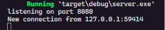
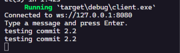
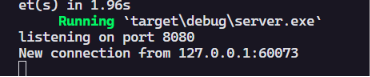
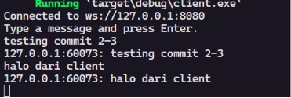
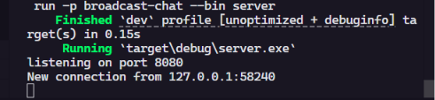
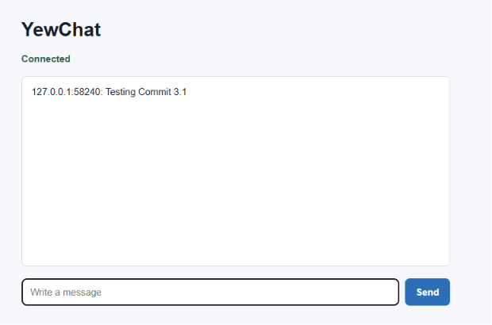
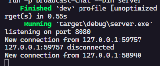
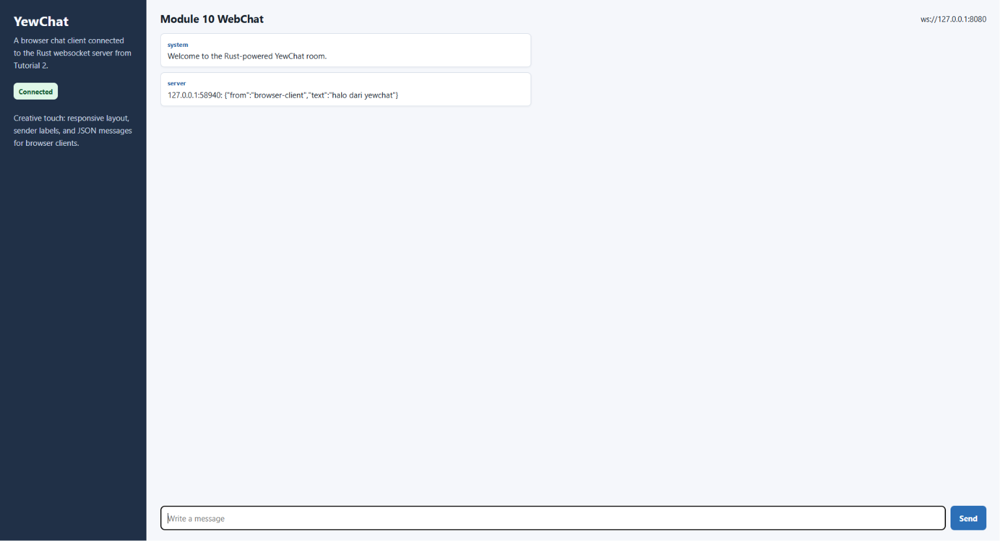
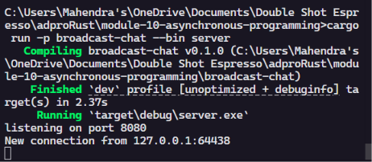
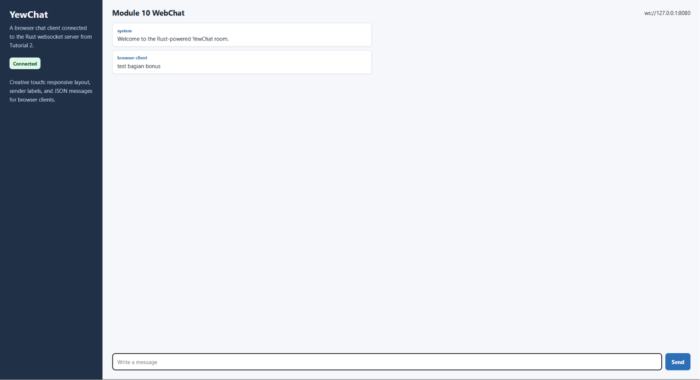

# Module 10 - Asynchronous Programming

## Experiment 1.1: Original timer from the book

Program pada package `timer` dibuat berdasarkan contoh executor sederhana dari Rust Async Book. Bagian utama program terdiri dari `TimerFuture`, `Spawner`, `Executor`, dan `Task`. `Spawner` memasukkan future ke queue, lalu `Executor` mengambil task tersebut dan melakukan polling. Ketika timer belum selesai, `TimerFuture` mengembalikan `Poll::Pending` dan menyimpan `waker`. Setelah thread timer selesai tidur selama dua detik, waker dipanggil agar task dapat dipoll kembali. Hasil akhirnya adalah pesan `howdy!` muncul lebih dulu, lalu setelah jeda timer muncul pesan `done!`.

Bukti run:

## Experiment 1.2: Understanding how it works.

Pada eksperimen ini saya menambahkan kalimat `Mahendra's Computer: hey hey!` setelah pemanggilan `spawner.spawn(...)`. Kalimat tersebut muncul sebelum `howdy!` dan `done!` karena `spawn` hanya memasukkan future ke queue, bukan langsung menjalankan seluruh isi async block sampai selesai. Isi async block baru mulai diproses ketika `executor.run()` dipanggil. Saat executor melakukan polling pertama, pesan `howdy!` muncul, lalu `TimerFuture` mengembalikan `Poll::Pending` karena timer belum selesai. Setelah dua detik, thread timer memanggil `waker` sehingga task dimasukkan kembali ke queue. Executor kemudian melakukan polling lagi dan program mencetak `done!`.

Bukti run:

## Experiment 1.3: Multiple Spawn and removing drop

Pada eksperimen ini saya menambahkan tiga pemanggilan `spawner.spawn(...)` agar ada beberapa task async yang masuk ke queue executor. `Spawner` berfungsi sebagai pengirim task ke channel yang akan dibaca oleh executor. `Executor` berfungsi mengambil task dari queue, membuat waker, lalu melakukan polling terhadap future yang tersimpan di dalam task. Jika future belum selesai, future tersebut disimpan kembali agar dapat dilanjutkan ketika waker dipanggil. `drop(spawner)` berfungsi menutup sender utama setelah semua task awal dimasukkan ke queue. Jika `drop(spawner)` dihapus, executor masih menganggap ada kemungkinan task baru dikirim dari spawner utama, sehingga program dapat terus menunggu walaupun semua timer sudah selesai. Hubungannya adalah spawner memasukkan pekerjaan, executor menjalankan pekerjaan, dan drop memberi sinyal bahwa tidak ada pekerjaan baru lagi dari spawner utama.

Bukti run dengan `drop(spawner)`:

Catatan percobaan tanpa `drop(spawner)`: output task tetap dapat muncul, tetapi proses tidak selesai sendiri karena executor masih menunggu pesan baru dari channel.

## Experiment 2.1: Original code, and how it run

Program `broadcast-chat` dibuat berdasarkan latihan Broadcast Chat Application dari Comprehensive Rust. Pada tahap ini server masih memakai port original `2000` dan client terhubung ke `ws://127.0.0.1:2000`. Server dijalankan pada satu terminal, lalu tiga client dijalankan pada tiga terminal lain. Ketika salah satu client mengetik pesan, pesan tersebut dikirim ke server melalui websocket. Server menerima pesan itu dan mengirimkannya ke broadcast channel. Semua client yang sedang subscribe ke channel tersebut akan menerima pesan dan mencetaknya di terminal masing-masing. Dengan cara ini satu pesan dari satu client dapat muncul di beberapa client tanpa client saling terhubung langsung.

Cara menjalankan server:
cargo run -p broadcast-chat --bin server

Cara menjalankan client:
cargo run -p broadcast-chat --bin client

Bukti run:

## Experiment 2.2: Modifying port

Pada eksperimen ini port websocket diubah dari `2000` menjadi `8080`. Perubahan perlu dilakukan di dua sisi karena websocket membutuhkan alamat yang sama antara server dan client. Pada sisi server, port diubah di file `broadcast-chat/src/bin/server.rs` pada bagian `TcpListener::bind("127.0.0.1:8080")`. Pada sisi client, alamat websocket diubah di file `broadcast-chat/src/bin/client.rs` menjadi `ws://127.0.0.1:8080`. Protokol yang digunakan tetap websocket dan ditandai dengan prefix `ws://` pada URL client. Jika hanya server yang diubah, client masih akan mencoba connect ke port lama sehingga koneksi gagal. Jika hanya client yang diubah, client akan mencoba port baru tetapi server tidak mendengarkan di sana. Setelah kedua sisi memakai port `8080`, chat tetap berjalan seperti eksperimen sebelumnya.

Cara menjalankan server:
cargo run -p broadcast-chat --bin server

Cara menjalankan client:
cargo run -p broadcast-chat --bin client

Bukti run:

## Experiment 2.3: Small changes, add IP and Port

Pada eksperimen ini server dimodifikasi agar pesan yang diterima dari client diberi informasi IP dan port pengirim. Informasi tersebut tersedia di sisi server melalui variabel `addr` yang didapat dari `listener.accept().await`. Perubahan dilakukan pada file `broadcast-chat/src/bin/server.rs`, tepatnya saat server menerima pesan teks dari websocket. Sebelum pesan dikirim ke broadcast channel, isi pesan diubah menjadi format `{addr}: {message}`. Saya memilih menambahkan informasi ini di server karena server mengetahui alamat remote sebenarnya dari setiap koneksi client. Jika alamat ditambahkan dari sisi client, data tersebut kurang kuat karena client bisa menulis identitas apa saja. Setelah perubahan ini, setiap client yang menerima pesan dapat melihat dari koneksi mana pesan itu berasal.

Cara menjalankan server:
cargo run -p broadcast-chat --bin server

Cara menjalankan client:
cargo run -p broadcast-chat --bin client

Bukti run:

## Experiment 3.1: Original code

Pada eksperimen ini saya menambahkan webchat client berbasis Yew. Client web berjalan di browser dengan bantuan Trunk dan mencoba terhubung ke websocket pada `ws://127.0.0.1:8080`. Sebelum menjalankan web client, server websocket dari Tutorial 2 perlu dijalankan terlebih dahulu. Ketika user mengetik pesan di browser, pesan dikirim melalui websocket ke server. Server kemudian membroadcast pesan tersebut ke client lain yang sedang terhubung. Pada tahap ini tampilan masih dibuat sederhana agar fokusnya ada pada koneksi websocket dan alur pesan asynchronous. Bagian ini memperlihatkan bahwa browser client tetap responsif sambil menunggu pesan masuk dari stream websocket.

Cara menjalankan server:
cargo run -p broadcast-chat --bin server

Cara menjalankan webchat:
rustup target add wasm32-unknown-unknown
cargo install trunk
cd webchat-yew
trunk serve --port 8081

Bukti run:

## Experiment 3.2: Be Creative!

Pada eksperimen ini saya menambahkan beberapa kreativitas pada webchat client. Tampilan webchat diubah menjadi layout dua panel yang responsif, dengan sidebar berisi nama aplikasi, status koneksi, dan konteks singkat. Pesan di area chat sekarang tampil dalam bentuk kartu kecil agar lebih mudah dibaca. Browser client juga mengirim pesan dalam format JSON berisi `from` dan `text`, sehingga pesan dari browser dapat memiliki label pengirim. Jika server belum berjalan, aplikasi menampilkan status menunggu server dan tombol kirim tidak aktif. Pada layar kecil, layout berubah menjadi satu kolom agar tetap nyaman digunakan. Perubahan ini membuat webchat tidak hanya berjalan secara teknis, tetapi juga lebih jelas dan enak dipakai sebagai aplikasi browser.

Cara menjalankan server:
cargo run -p broadcast-chat --bin server

Cara menjalankan webchat:
cd webchat-yew
trunk serve --port 8081

Bukti run:

## Bonus: Rust Websocket server for YewChat!

Pada bagian bonus ini server websocket Rust dari Tutorial 2 dimodifikasi agar dapat melayani YewChat dari Tutorial 3. Masalah utamanya adalah format pesan: client console mengirim teks biasa, sedangkan YewChat lebih cocok memakai pesan JSON dengan field `from` dan `text`. Untuk menyelesaikannya, server Rust sekarang mencoba membaca setiap pesan sebagai JSON terlebih dahulu. Jika pesan valid JSON, server mempertahankan format tersebut dan membroadcast ulang ke semua client. Jika pesan bukan JSON, server mengubahnya menjadi JSON dengan `from` berisi IP dan port pengirim, lalu `text` berisi pesan asli. Perubahan ini membuat client browser dapat menampilkan label pengirim dengan rapi, sementara client console tetap dapat digunakan. Saya menganggap perubahan ini berhasil jika YewChat dapat connect ke server Rust, mengirim pesan, menerima pesan broadcast, dan tetap kompatibel dengan client terminal. Saya lebih memilih versi Rust untuk server karena tipe data pesan bisa dibuat eksplisit dengan `serde`, error handling lebih terstruktur, dan server console serta webchat bisa berada dalam satu alur pembelajaran Rust.

Cara menjalankan server Rust:
cargo run -p broadcast-chat --bin server

Cara menjalankan YewChat:
cd webchat-yew
trunk serve --port 8081

Bukti run:

