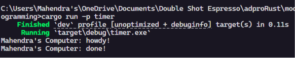
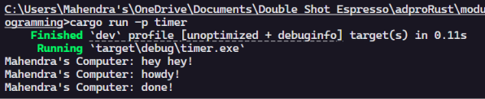
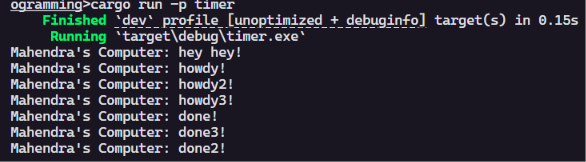
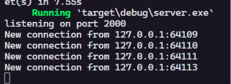
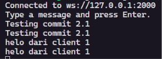
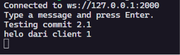
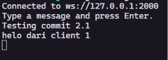
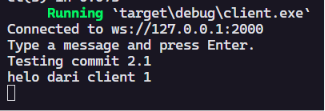

# Module 10 - Asynchronous Programming

## Experiment 1.1: Original timer from the book

Program pada package `timer` dibuat berdasarkan contoh executor sederhana dari Rust Async Book. Bagian utama program terdiri dari `TimerFuture`, `Spawner`, `Executor`, dan `Task`. `Spawner` memasukkan future ke queue, lalu `Executor` mengambil task tersebut dan melakukan polling. Ketika timer belum selesai, `TimerFuture` mengembalikan `Poll::Pending` dan menyimpan `waker`. Setelah thread timer selesai tidur selama dua detik, waker dipanggil agar task dapat dipoll kembali. Hasil akhirnya adalah pesan `howdy!` muncul lebih dulu, lalu setelah jeda timer muncul pesan `done!`.

Bukti run:

## Experiment 1.2: Understanding how it works.

Pada eksperimen ini saya menambahkan kalimat `Mahendra's Computer: hey hey!` setelah pemanggilan `spawner.spawn(...)`. Kalimat tersebut muncul sebelum `howdy!` dan `done!` karena `spawn` hanya memasukkan future ke queue, bukan langsung menjalankan seluruh isi async block sampai selesai. Isi async block baru mulai diproses ketika `executor.run()` dipanggil. Saat executor melakukan polling pertama, pesan `howdy!` muncul, lalu `TimerFuture` mengembalikan `Poll::Pending` karena timer belum selesai. Setelah dua detik, thread timer memanggil `waker` sehingga task dimasukkan kembali ke queue. Executor kemudian melakukan polling lagi dan program mencetak `done!`.

Bukti run:

## Experiment 1.3: Multiple Spawn and removing drop

Pada eksperimen ini saya menambahkan tiga pemanggilan `spawner.spawn(...)` agar ada beberapa task async yang masuk ke queue executor. `Spawner` berfungsi sebagai pengirim task ke channel yang akan dibaca oleh executor. `Executor` berfungsi mengambil task dari queue, membuat waker, lalu melakukan polling terhadap future yang tersimpan di dalam task. Jika future belum selesai, future tersebut disimpan kembali agar dapat dilanjutkan ketika waker dipanggil. `drop(spawner)` berfungsi menutup sender utama setelah semua task awal dimasukkan ke queue. Jika `drop(spawner)` dihapus, executor masih menganggap ada kemungkinan task baru dikirim dari spawner utama, sehingga program dapat terus menunggu walaupun semua timer sudah selesai. Hubungannya adalah spawner memasukkan pekerjaan, executor menjalankan pekerjaan, dan drop memberi sinyal bahwa tidak ada pekerjaan baru lagi dari spawner utama.

Bukti run dengan `drop(spawner)`:

Catatan percobaan tanpa `drop(spawner)`: output task tetap dapat muncul, tetapi proses tidak selesai sendiri karena executor masih menunggu pesan baru dari channel.

## Experiment 2.1: Original code, and how it run

Program `broadcast-chat` dibuat berdasarkan latihan Broadcast Chat Application dari Comprehensive Rust. Pada tahap ini server masih memakai port original `2000` dan client terhubung ke `ws://127.0.0.1:2000`. Server dijalankan pada satu terminal, lalu tiga client dijalankan pada tiga terminal lain. Ketika salah satu client mengetik pesan, pesan tersebut dikirim ke server melalui websocket. Server menerima pesan itu dan mengirimkannya ke broadcast channel. Semua client yang sedang subscribe ke channel tersebut akan menerima pesan dan mencetaknya di terminal masing-masing. Dengan cara ini satu pesan dari satu client dapat muncul di beberapa client tanpa client saling terhubung langsung.

Bukti run:

